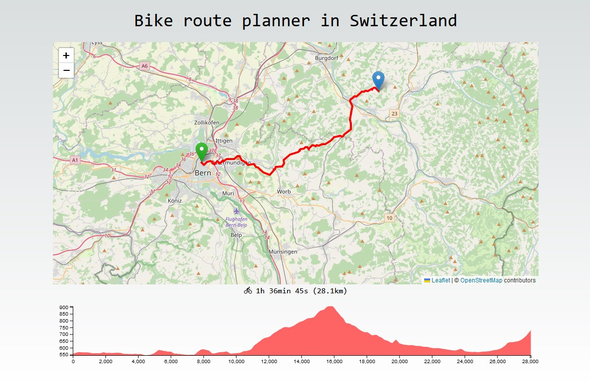

# BikeCH

### Bike route planner in Switzerland

### Website: <a href="https://bike-ch.vercel.app" target="_blank">https://bike-ch.vercel.app/</a>

## Introduction

This project use Typescript/Next and the Openrouteservice API to make a web app for bike itinerary planning. It calculate the shortest bike route between a chosen starting and ending point and display the optimal path with it's elevation profile.



## Features

- Effortless Route Planning: Plan a bike tour by entering the starting and ending points.
- Interactive Map: Visualize the bike route on an interactive map.
- Distance and Time Estimates: Get estimates for the distance and time it will take.
- Elevation Profile: View the elevation profile of the chosen route to prepare for uphill or downhill segments.

## Usage

Just click on the map to input the starting and ending locations and a few moments later it will display the route details.

## Developing Locally

You can clone & create this repo with the following command

```bash
git clone https://github.com/PopoDev/BikeCH.git
```

## Getting Started

First, install the dependencies:

```bash
npm install
# or
yarn
# or
pnpm install
```

Then, run the development server:

```bash
npm run dev
# or
yarn dev
# or
pnpm dev
```

Open [http://localhost:3000](http://localhost:3000) with your browser to see the result.

The Flask server will be running on [http://127.0.0.1:5328](http://127.0.0.1:5328) – feel free to change the port in `package.json` (you'll also need to update it in `next.config.js`).

## License

This project is licensed under the MIT License
